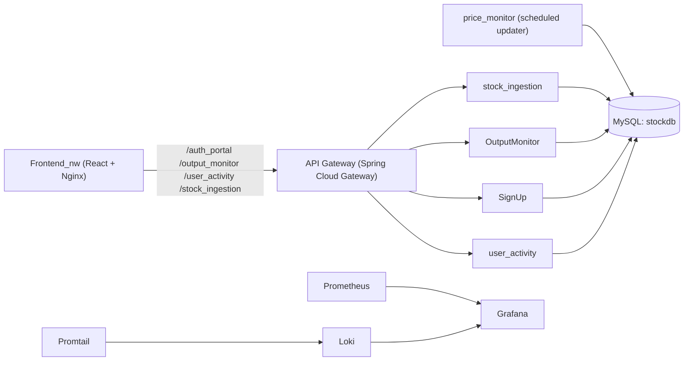

# STOX (Stocks SPE Project)

[](https://adoptium.net/)
[](https://spring.io/projects/spring-boot)
[](https://react.dev/)
[](https://vite.dev/)
[](JenkinsFile)

STOX is a microservices-based stock portfolio simulator. It’s designed to run on Kubernetes with a Spring Cloud API Gateway, several Spring Boot services backed by MySQL, a React (Vite + Tailwind) frontend, and optional monitoring (Prometheus/Grafana/Loki).

## What the project does

**Core workflow**

- Ingest a set of stocks into MySQL (`stock_ingestion`).
- Continuously generate synthetic price updates (random % deltas) and maintain a “current price” table (`price_monitor`).
- Retrieve stock details, price history, portfolio, and P&L for users (`OutputMonitor`).
- Sign up / log in users (`SignUp`).
- Record user activity: buy/sell transactions and deposit/withdraw operations (`user_activity`).

**Repository layout**

- [Backend/](Backend/) — Spring Boot microservices (each is its own Maven project with `mvnw`).
- [Frontend_nw/](Frontend_nw/) — primary frontend (Dockerized build served by Nginx + reverse proxy to the gateway).
- [frontend/](frontend/) — alternate/older frontend implementation (not used by the Jenkins K8s deployment scripts).
- [jenkins/](jenkins/) + [JenkinsFile](JenkinsFile) — CI/CD pipeline that builds/pushes Docker images and deploys to Kubernetes.
- [mysql-statefulset.yaml](mysql-statefulset.yaml) / [mysql-deployment.yaml](mysql-deployment.yaml) — MySQL Kubernetes manifests.

### Architecture



### Services and ports

These are the default ports when running services directly (locally) via Spring Boot:

| Component | Folder | Default port | Notes |
|---|---|---:|---|
| API Gateway | `Backend/gateway` | `8085` | Routes by path prefix, exposes `/actuator/*` |
| Stock ingestion | `Backend/stock_ingestion` | `8090` | Creates/updates stock schema (`ddl-auto=update`) |
| Price monitor | `Backend/price_monitor` | `8091` | Starts scheduled updates at app startup |
| Output monitor | `Backend/OutputMonitor` | `9000` | Read APIs for stocks/portfolio/P&L |
| Auth (signup/login) | `Backend/SignUp` | `9010` | User signup + login APIs |
| User activity | `Backend/user_activity` | `9020` | Buy/sell + deposit/withdraw APIs |

When deployed to Kubernetes via the Jenkins pipeline, Services are created on port `80` and forward to the app ports (the gateway routes assume this).

### Gateway route prefixes

Gateway routes are configured in [Backend/gateway/src/main/resources/application.yml](Backend/gateway/src/main/resources/application.yml):

- `/stock_ingestion/**` → `stock-ingestion-service` (StripPrefix=1)
- `/price_monitor/**` → `price-monitor-service` (StripPrefix=1)
- `/output_monitor/**` → `outputmonitor-service` (StripPrefix=1)
- `/auth_portal/**` → `signup-service` (StripPrefix=1)
- `/user_activity/**` → `user-activity-service` (StripPrefix=1)

## Why the project is useful

- **Reference microservices stack**: API gateway + multiple Spring Boot services with clear separation of concerns.
- **Kubernetes-first**: Dockerfiles for each component and a Jenkins pipeline that deploys the full stack.
- **Observability included**: Actuator + Prometheus scrape config, plus Grafana + Loki/Promtail for logs.
- **Practical full-stack demo**: React UI calls backend routes that mirror the gateway path prefixes.

## How users can get started

### Prerequisites

- Java `17` (required for backend services)
- Node.js `18+` (required for frontend build/dev)
- Docker (recommended)
- Kubernetes cluster + `kubectl` (required for the “full stack” path)
- Jenkins (optional, but recommended if you want to use the provided pipeline)

### Option A — Run the full stack on Kubernetes (recommended)

The default configs assume in-cluster DNS names (e.g. `mysql`, `gateway-service`) and Kubernetes Services on port `80`. The most repeatable way to bring everything up is the Jenkins pipeline.

1. Ensure your Kubernetes cluster is reachable from Jenkins (via a kubeconfig).
2. Configure Jenkins credentials used by `JenkinsFile`:
	 - `dockerhub-credentials-id` — Docker Hub username/password
	 - `kubeconfig-credentials-id` — kubeconfig for `kubectl`
3. Run the pipeline defined in [JenkinsFile](JenkinsFile).

**After deploy (defaults from the Groovy configs):**

- Frontend (NodePort): `http://<k8s-node-ip>:31000`
- Grafana (NodePort): `http://<k8s-node-ip>:30300` (default login `admin` / `admin`)
- Prometheus (NodePort): `http://<k8s-node-ip>:30090`
- Loki (NodePort): `http://<k8s-node-ip>:30100`

**API access from your laptop:**

Most services are `ClusterIP` only. To reach the gateway from outside the cluster, use port-forwarding:

```bash
kubectl port-forward svc/gateway-service 8085:80
curl http://localhost:8085/actuator/health
```

### Option B — Run locally (API-first development)

This is useful for developing/debugging individual services. You’ll typically run MySQL in Docker and start services via Maven.

1. Start MySQL locally:

```bash
docker run --name mysql -e MYSQL_ROOT_PASSWORD=gaurav -e MYSQL_DATABASE=stockdb -p 3306:3306 -d mysql:8
```

2. Start backend services (each in its folder). For local runs, override the datasource host from `mysql` → `localhost`.

Example (macOS/Linux):

```bash
cd Backend/stock_ingestion
SPRING_DATASOURCE_URL='jdbc:mysql://localhost:3306/stockdb?createDatabaseIfNotExist=true' \
SPRING_DATASOURCE_USERNAME='root' \
SPRING_DATASOURCE_PASSWORD='gaurav' \
./mvnw spring-boot:run
```

Example (Windows PowerShell):

```powershell
cd Backend\stock_ingestion
$env:SPRING_DATASOURCE_URL = "jdbc:mysql://localhost:3306/stockdb?createDatabaseIfNotExist=true"
$env:SPRING_DATASOURCE_USERNAME = "root"
$env:SPRING_DATASOURCE_PASSWORD = "gaurav"
./mvnw.cmd spring-boot:run
```

Notes:

- `stock_ingestion` uses `ddl-auto=update` and can create/update the **stock** tables in a fresh DB.
- `SignUp` and `user_activity` use `ddl-auto=none` by default; for a brand-new local DB you can run them with `--spring.jpa.hibernate.ddl-auto=update` (dev only).
- The gateway’s default route URIs point at Kubernetes Service names on port `80`. For local development, it’s usually easiest to call services directly on their ports, or create your own local gateway config.

### Usage examples (direct to services)

Create a couple of stocks (ingestion service):

```bash
curl -X POST http://localhost:8090/base/createStocks \
	-H "Content-Type: application/json" \
	-d '[
		{
			"stockName": "Acme Corp",
			"stockSymbol": "ACME",
			"stockExchange": "NASDAQ",
			"stockSector": "Tech",
			"initialPrice": 100.0,
			"stockDescription": "Demo stock",
			"volatility": 0.0
		}
	]'
```

Start the price monitor (`Backend/price_monitor`) and it will begin scheduled updates automatically. Then query live stock details (OutputMonitor):

```bash
curl http://localhost:9000/retrieve/allStockDetails
```

Register a user (SignUp):

```bash
curl -X POST http://localhost:9010/signup \
	-H "Content-Type: application/json" \
	-d '{
		"username": "demo",
		"first_name": "Demo",
		"last_name": "User",
		"email": "demo@example.com",
		"password": "password",
		"confirm_password": "password",
		"payment_mode": "CARD"
	}'
```

Record a BUY transaction (user activity):

```bash
curl -X POST http://localhost:9020/transactions/buysell \
	-H "Content-Type: application/json" \
	-d '{
		"user_id": 1,
		"stock_id": 1,
		"quantity": 10,
		"amount": 1000,
		"transaction_type": "BUY"
	}'
```

## Where users can get help

- **Project entrypoints**
	- Gateway routing: [Backend/gateway/src/main/resources/application.yml](Backend/gateway/src/main/resources/application.yml)
	- Frontend reverse-proxy rules: [Frontend_nw/nginx.conf](Frontend_nw/nginx.conf)
	- CI/CD pipeline: [JenkinsFile](JenkinsFile) and [jenkins/modules/](jenkins/modules/)
	- Monitoring manifests: [jenkins/configs/](jenkins/configs/)
- **Health + metrics**: each Spring Boot service exposes `/actuator/health` and `/actuator/prometheus` (see the `management.*` settings in each service config).
- **Questions/bugs**: open a GitHub Issue (or your internal tracker if this is a fork).

## License

This project is licensed under the MIT License.
